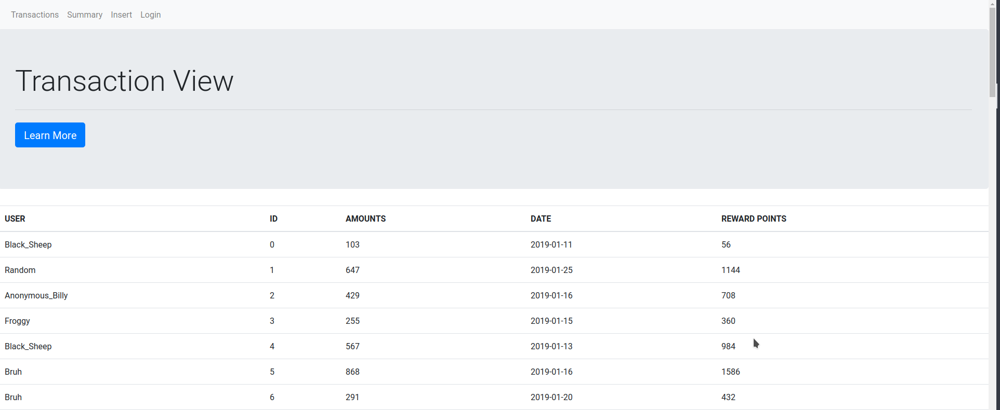
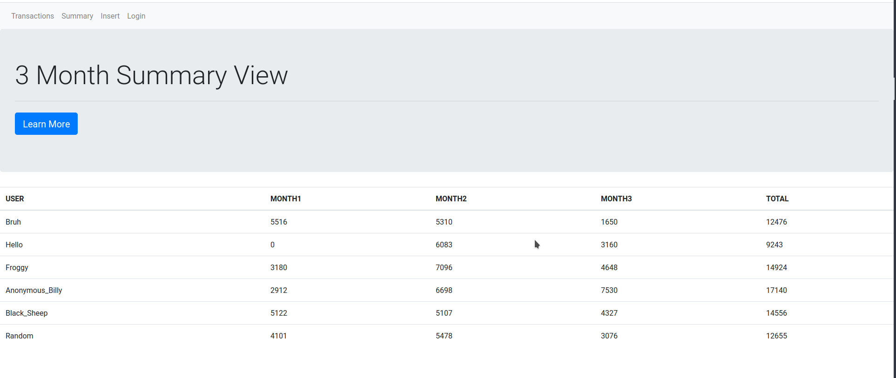
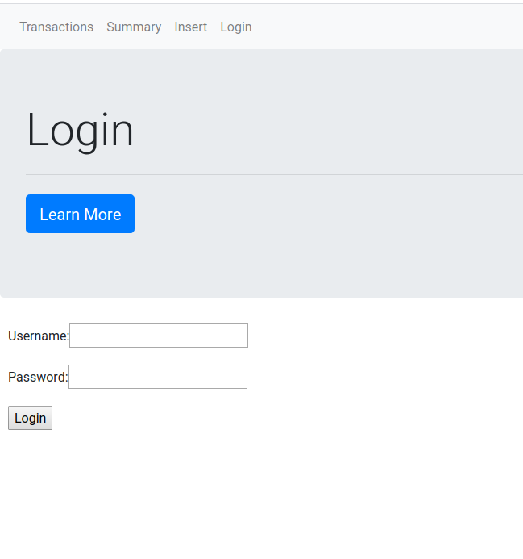
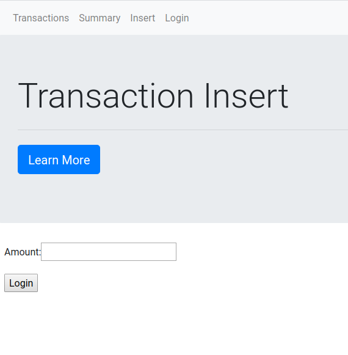

# Transaction Project
## Overview
I was assigned this particular project to implement a basic transaction formula using React
and any kind of technology that would express my skillset. I used Scala, ReactJS (of course), PostgreSQL and Play Framework. There were two main things that I had to accomplished in order to call it a minimium viable product: correctly implement the transaction formula and calculate the total amount per month (in a 3 month cycle) per customer. In hindsight, I probably shouldn't have done a full-stack but it was pretty cool to do something hands on again.

## Set up
1. Install Scala, ReactJS, and PostgreSQL
   1. Luckily for me, I'm using Linux so alot of the things were updated and were easily applied afterwards.
   2. Intellij basically took care of Scala for me but PostgreSQL and Pgadmin to a degree were a pain to install and set up.
   3. npm install to set up the frontend side of things
2. Setting up the database
   1. `sudo -u postgres psql --command "CREATE USER scalauser WITH SUPERUSER\
PASSWORD 'scalapass';"`
    2. `sudo -u postgres createdb -O scalauser scaladb`
    3. _Warning_ - You might need to change your auth from peer to md5 depending on your set up but that's what I experienced
3. Running the application - at the base of the project directory
   1. In one terminal window, run `sbt run` for the backend service
   2. In another, run `npm run watch` for the frontend service
   3. ideally, if you ran the database set up commands, the server should technically be up but i would double check

## Project
### Transaction View or Raw Data in a way

The transaction view isn't a part of the requirement but something I thought would be really cool (lowkey spent way too much time than I expected). This view is essentially all of the data that is in the database being fetched. The data was generated by a python script I included in the "/data" folder in app. It produces 100 randomized entries as well as the insert command to manually put into the database.

### Transaction Summary or 3 Month Period View

This is the main event I guess haha. Essentially, for each user, it would add up all the corresponding months that makes up a 3 month period (in this case, Jan., Feb., and Mar.). I put MONTH1, MONTH2, and MONTH3 but I really should have created a mapping that linked the months to an integer value. TOTAL is the summation of MONTH1, MONTH2, and MONTH3 reward points. A good extension to this would be adding a summary total bar that adds all the values up.

### Login

OOF, it is pretty barebone much like the insertion of a single transaction. I would say this is due to how ambituous I got with this assignment (relative to my skillset) and I didn't realized how much I didn't know using Play Framework's view concept and how it would integrate with React. Ideally, I really wanted to hide the results and that the user would have to login in to see their results and potentially others as well.

### Insertion

Yup, so it has only one submit box mainly because it is also barebone as well. I figured this would be the section an anonymous person would use or someone logged in. This is where the application would somehow grab the person's userid or show "Anonymous Beaver" as a random person. Also, it is a sinle input becuase the Date and id are by default based on the backend and the present.